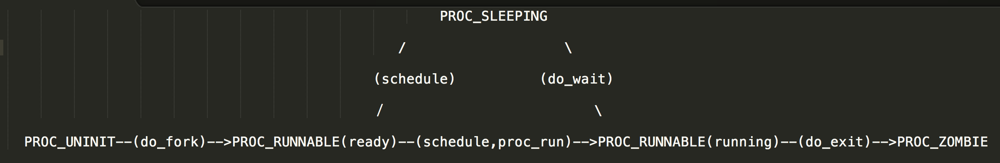

#Lab5 实验报告
计23班 杨煜 2011010312

##练习0：填写已有实验
按要求完成Lab1-4实验代码的填写。

##练习1：加载应用程序并执行
###设计实现过程
按照trapframe结构体在注释中的定义，一一实现。

###描述当创建一个用户态进程并加载了应用程序后，CPU是如何让这个应用程序最终在用户态执行起来的
user_main进程的初始化函数init\_main依次调用了：

- do\_wait(proc.c)
- schedule(sched.c)
- proc\_run(proc.c)

user\_main函数开始运行后又依次调用：

- kernel\_execve(proc.c)
- vector128(vectors.S)-
- \_\_alltraps(trapentry.S)
- trap(trap.c)
- trap_dispatch(trap.c)
- syscall(syscall/syscall.c)
- sys_exec(syscall/syscall.c）
- do_execve(proc.c)
- load_icode(proc.c)

申请内存并进行初始化，申请页目录表并将boot\_pgdir拷贝，以正确建立内核态运行的合法虚拟地址空间，然后再根据elf的信息建立各段的用户态运行合法虚拟地址空间（vma），然后再分配相应物理内存空间，建立页表，拷贝内容，设置用户栈的vma，分配物理内存，建立页表，清空并重设trapframe使得iret后能回到用户态正确继续执行，返回时执行：

- \_\_trapret(trapentry.S)

最后执行iret时切换回用户进程的第一句

- \_start(initcode.S)

##练习2：父进程复制自己的内存空间给子进程
###设计实现过程
按照注释的指导依次实现。

###请在实验报告中简要说明如何设计实现"Copy on Write机制"，给出概要设计，鼓励给出详细设计。
在do\_pgfault函数中实现COW：若页面在内存中而且为可写的状态，则直接写即可；若页面在内存中但不可写，则可先将页面拷贝一份，并修改页表指向新的拷贝，然后再写；若页面不在内存中则利用页面置换算法换入内存，此时该页面应被该进程独占，此时可写，直接写即可。

##练习3：阅读分析源代码，理解进程执行 fork/exec/wait/exit 的实现，以及系统调用的实现
###请在实验报告中简要说明你对 fork/exec/wait/exit函数的分析
fork：

- 分配新的进程控制块，
- 分配内核栈，
- 共享或拷贝父进程内存，
- 设置trapframe和context
- 连入进程链表，改为就绪状态，返回子进程pid

exec：

- 调用load\_icode申请内存并初始化，
- 申请页目录表并将boot\_pgdir拷贝过来以正确映射内核空间，
- 根据elf信息建立各段的vma，
- 分配相应物理内存空间、
- 建立页表、拷贝内容，
- 设置用户栈的vma、
- 分配物理内存、
- 建立页表，
- 清空并重设trapframe使得iret后能回到用户态正确继续执行

wait：

- 若有子进程已完成则释放其内核栈、进程管理块，
- 若有子进程但仍在运行则接着等

exit：

- 回收内存空间，
- 更新状态为僵尸，
- 给出退出码。

###请分析fork/exec/wait/exit在实现中是如何影响进程的执行状态的

- fork申请的新的进程控制块时，状态是PROC\_UNINIT，完成时状态是PROC\_RUNNABLE
- exec并不改变执行状态，它只是执行过程中的一段代码
- wait时进程状态变为PROC\_SLEEPING，此时等待子进程，在之后被唤醒时，尝试清理僵尸子进程。
- exit时进程状态变为PROC\_ZOMBIE，此时唤醒父进程清理自己
- 
###请给出ucore中一个用户态进程的执行状态生命周期图

##总结
本Lab涉及到的重要知识点：

- 系统调用的全过程
- 新建内核线程转变为用户进程的过程

未涉及到的知识点：

- wait系统调用的行为--所对应的do\_wait函数在实验中没有体现
- 用户进程退出的过程--所对应do\_exit函数在实验中没有体现

